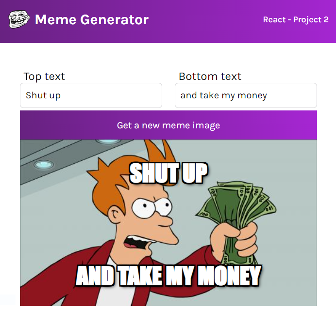

# Meme generator

When the app first loads it is going to reach out to an API and get 100 of the most popular meme images at that time. The app give the user the ability to personalise the meme image by adding texts, and also to click a button to randomly choose a new memeimage.

Tools used: [Vite](https://vitejs.dev/)

## To run:
- Clone the repository
- Install dependencies `npm install` and `npm install html2canvas`
- Run `npm run dev`
